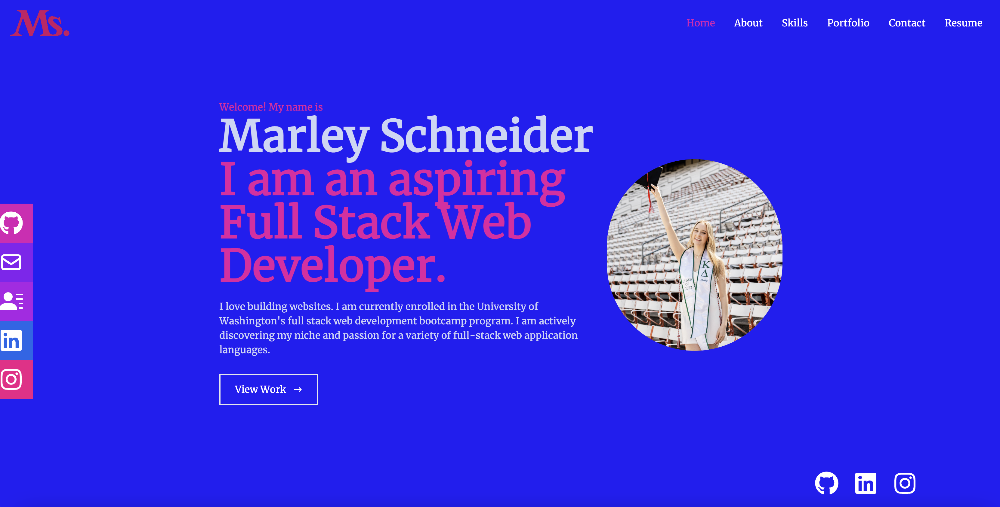

# react-to-marley👋
A web development portfolio for Marley Schneider made with React.

## Description🎬
Welcome to my react portfolio, the second version of a portfolio I created to display my web development work. I am Marley Schneider, an aspiring full stack web developer who is eager to enter the field of web development professionally. To develop this portfolio, I combined fundamental CSS with Tailwinds CSS, all powered by React.

This portfolio was made to highlight my work from the Web Development Bootcamp at the University of Washington. I have experimented with and developed a variety of applications that were taught to me throughout this bootcamp, including: OOP (Object-Oriented Programming), HTML, CSS, MySQL, Express.js, JavaScript, Node.js, Model-View-Controller (MVC), React.j, Handlebars.js, and more!

Chat with me! Through this portfolio, I am excited to share new projects I have created as well as learn about web development possibilities. I am eager to launch my web development career and produce applications that are cutting-edge and intriguing to the web development community. 😆

## Screenshot of Live Application📸

## Link to Live Webpage🕸

## Table of Contents📘
* [Installation](#installation)
* [Dependencies](#dependencies)
* [Usage](#usage)
* [Contributors](#contributors)
* [Questions](#questions)

## Installation💽
To install this project locally:
- Clone this repository on Github and open it in your personal IDE. 
- Install all required dependencies by running `npm install` in your terminal.
- After dependencies are installed, run `npm run start` to launch the react portfolio locally on your browser.

## Dependencies💻
`React`, `Tailwinds CSS`, `Javascript`

## Usage🙌
Visit the live webpage link to get to know me and the projects I have created. I am happy you are here!

## Contributors👈
Created by Marley Schneider. 
- Thank you to askBCS for assisting me with Navbar functionality, color changing components, image rendering, and page setup. 

## Getting Started with Create React App

This project was bootstrapped with [Create React App](https://github.com/facebook/create-react-app).

## Available Scripts

In the project directory, you can run:

### `npm start`

Runs the app in the development mode.\
Open [http://localhost:3000](http://localhost:3000) to view it in your browser.

The page will reload when you make changes.\
You may also see any lint errors in the console.

### `npm test`

Launches the test runner in the interactive watch mode.\
See the section about [running tests](https://facebook.github.io/create-react-app/docs/running-tests) for more information.

### `npm run build`

Builds the app for production to the `build` folder.\
It correctly bundles React in production mode and optimizes the build for the best performance.

The build is minified and the filenames include the hashes.\
Your app is ready to be deployed!

See the section about [deployment](https://facebook.github.io/create-react-app/docs/deployment) for more information.

### `npm run eject`

**Note: this is a one-way operation. Once you `eject`, you can't go back!**

If you aren't satisfied with the build tool and configuration choices, you can `eject` at any time. This command will remove the single build dependency from your project.

Instead, it will copy all the configuration files and the transitive dependencies (webpack, Babel, ESLint, etc) right into your project so you have full control over them. All of the commands except `eject` will still work, but they will point to the copied scripts so you can tweak them. At this point you're on your own.

You don't have to ever use `eject`. The curated feature set is suitable for small and middle deployments, and you shouldn't feel obligated to use this feature. However we understand that this tool wouldn't be useful if you couldn't customize it when you are ready for it.

## Learn More

You can learn more in the [Create React App documentation](https://facebook.github.io/create-react-app/docs/getting-started).

To learn React, check out the [React documentation](https://reactjs.org/).

## Questions
If you have questions, please send them [here](mailto:marleysue@gmail.com?subject=[GitHub]%20Dev%20Connect) or visit [github/marleyschneiderr](https://github.com/marleyschneiderr).

